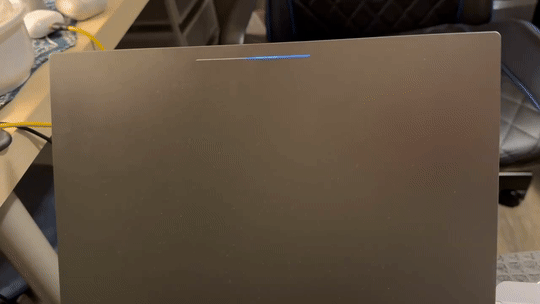

# claude-pixel-light

Programming the Chromebook Pixel's lid **lightbar** (4 RGB LEDs) into a rich status
display for **Claude Code**.

It is a client of the [`pixel-lights`](https://github.com/LuxxxLucy/pixel-lights) daemon:
Claude Code hooks call `claude-light hook <Event>`, which sends effect commands to the daemon's fifo.

```sh
make && sudo make install   # -> /usr/local/bin/claude-light
```

## Demo



